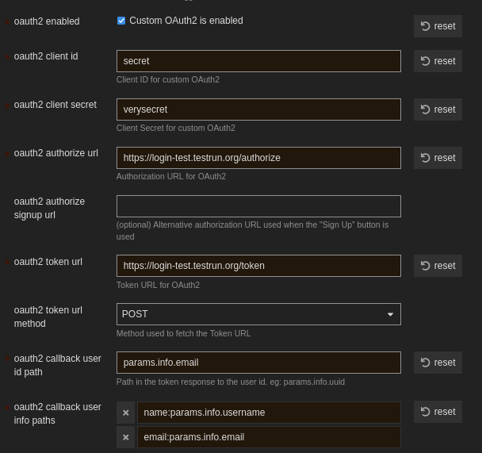

# How to run loginbot for Discourse?

The loginbot implements the OAuth2 specification partially and it covers the API [Discourse](https://www.discourse.org/) needs. Therefore, you can use it for 
adding "Login with DeltaChat" to your Discourse instance. 

## Getting a compiled version

Each release comes with a compiled version for Linux x86 64 musl. This binary is stripped, optimized and should run on any Linux server with the
said architecture regardless of the `libc` used in the distribution as the binary comes with its own `libc`. However, if you want it for some other 
platform, you can [install the Rust toolchain](https://www.rust-lang.org/learn/get-started) and then `cargo build -r` in the project's directory
to get an optimized release binary for your platform.

## Prerequirements

 - A server to run loginbot on it. Root access is NOT required nor it is recommended to run loginbot as root.
 - A webserver like nginx to act as reverse proxy so that the outside world can talk with loginbot web APIs.
 - An email account for the loginbot
 - Admin access to the Discourse instance

## Steps

 1. Download the latest release from Releases and get the binary
 2. Modify the TOML config file(`example_config.toml`) to your need. You need an email account somewhere for the loginbot
 3. Use `bash gen_secret.sh` to generate two random strings for `client_id` and `client_secret` in `oauth` section of the config file.
 4. Enter `https://discourse.tld/auth/oauth2_basic/callback` as `redirect_uri` where `discouse.tld` is the domain address of your Discourse.
 5. Run the binary. By default, it looks for `config.toml` in the current directory but you can specify somewhere else by a command line argument: `./loginbot /path/to/config.toml`
 6. For production runs, a service manager is highly recommended for easier management of the loginbot process. For instance on Debian based distros and many others, systemd is used.
 7. The bot's web API is listening to `listen_addr` as specified in the config file. You need your webserver to act as a reverse proxy for the login bot.
 8. In your Discourse instance, navigate to the admin panel. Then open Site settings and then "Login" section.
 9. Tick `oauth2 enabled`
 10. Enter the same `client_id` and `client_secret` which you've entered for the loginbot configuration file in `oauth` section.
 11. In `oauth2 authorize url` you must enter the URL of `/authorize` endpoint of your loginbot. For instance if your loginbot web API is accessible from `https://foo.com/` then the authorize URL will be `https://foo.com/authorize`
 12. Fill "oauth2 token url" like the authorize URL. E.g. `https://foo.com/token`
 13. Select `POST` for `oauth2 token url method`. Currently `GET` method is NOT supported by loginbot for the `/token` endpoint.
 14. Enter `params.info.email` as `oauth2 callback user id path`
 15. Add `name:params.info.username` and `email:params.info.email` as items for `oauth2 callback user info paths`.
 16. There are other stuff you can configure according to your need. You should look up Discourse docs for this. For example, `oauth2 button title` is the title of button the user sees. Like you can enter "Login with DeltaChat"

This photo shows an example configuration. The loginbot web API is accessible from `https://login-test.testrun.org/`

