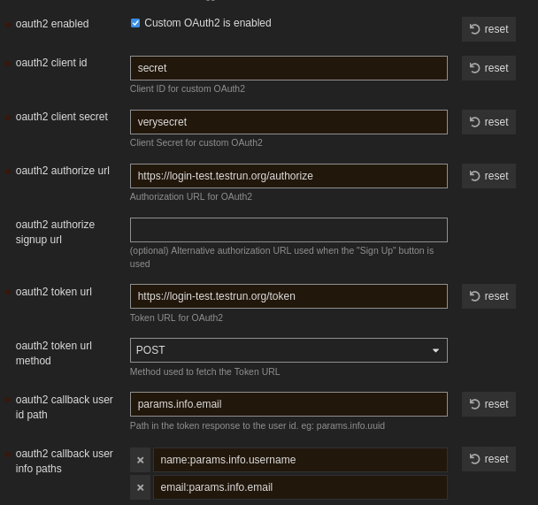

# DeltaChat Loginbot for OAuth2

> **⚠️ Experimental** this project is deployed to support.delta.chat
> but otherwise not considered ready for production use.

Loginbot is an OAuth2 provider that lets users
log in to web applications (e.g. Discourse, Wiki.js)
with their DeltaChat profile.

Authentication works via the SecureJoin protocol:
the user scans a QR code, joins a group,
and the bot confirms their identity
and sends the browser window to the Discourse profile setup.


## Setting up Loginbot with Discourse

Loginbot experimentally implements enough of the OAuth2 spec
to serve as a "Login with DeltaChat" provider
for [Discourse](https://www.discourse.org/).


## Prerequisites

- An e-mail address for the bot.

- Admin access to the Discourse instance.

- A server with a public IP
  (root access is not required).

- A reverse-proxy (e.g. nginx) with TLS
  in front of loginbot's `listen_addr`.


## Install

Download the latest release binary (Linux x86-64 musl)
from the GitHub Releases page, or build from source:

```bash
cargo build --release
```


## Configure

1. Copy `example_config.toml` to `config.toml`
   and fill in the bot's `email` and `password`.

2. Generate `client_id` and `client_secret`:

   ```bash
   bash scripts/gen_secret.sh   # run twice, one per field
   ```

3. Set `redirect_uri` to
   `https://<discourse-domain>/auth/oauth2_basic/callback`.

4. Start the bot:

   ```bash
   ./loginbot /path/to/config.toml
   ```

   A systemd unit template is provided in `loginbot.service`.


## Discourse settings

Install the
[Discourse OAuth2 Basic plugin](https://github.com/discourse/discourse-oauth2-basic),
then configure it in *Admin → Site Settings → Login*:

```
oauth2 enabled:                    true
oauth2 client id:                  <client_id from config.toml>
oauth2 client secret:              <client_secret from config.toml>
oauth2 authorize url:              https://<loginbot-domain>/authorize
oauth2 token url:                  https://<loginbot-domain>/token
oauth2 token url method:           POST
oauth2 callback user id path:      params.info.email
oauth2 callback user info paths:   name:params.info.username
                                   email:params.info.email
oauth2 fetch user details:         false
oauth2 email verified:             true
oauth2 button title:               Login with Delta Chat
oauth2 allow association change:   true
```


