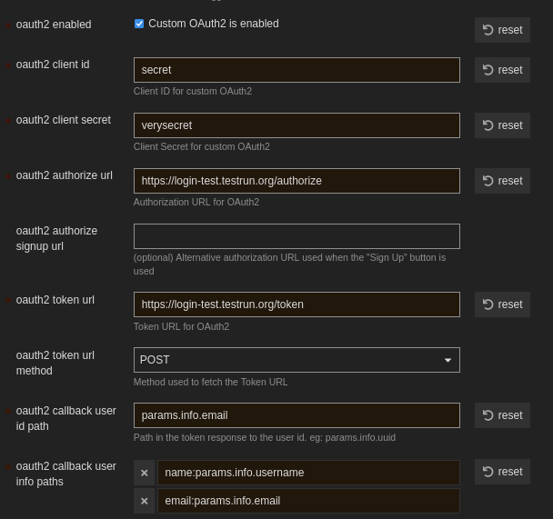

# How to run loginbot for Discourse?

The loginbot implements the OAuth2 specification partially and it covers the API [Discourse](https://www.discourse.org/) needs. Therefore, you can use it for 
adding "Login with DeltaChat" to your Discourse instance. 

The HOW-TO-RUN.md document describes the steps required to use loginbot for any website. This document gives extra hints to use it for Discourse.

## Prerequirements

Other than the prerequirements specified in HOW-TO-RUN document, you also need admin access on the Discourse instance.

## Steps

 - Follow the steps in HOW-TO-RUN document.
 - In your Discourse instance, navigate to the admin panel. Then open Site settings and then "Login" section.
 - Tick "oauth2 enabled"
 - Enter the same client id and secret which you've entered for the loginbot configuration file in "oauth2 client secret" and "oauth2 client id".
 - In "oauth2 authorize url" you must enter the URL of `/authorize` endpoint of your loginbot. For instance if your loginbot web API is accessible from `https://foo.com/` then the authorize URL will be `https://foo.com/authorize`
 - Fill "oauth2 token url" like the authorize URL.
 - Select `POST` for "oauth2 token url method". Currently `GET` method is NOT supported by loginbot for the `/token` endpoint.
 - Enter `params.info.email` as "oauth2 callback user id path"
 - Add "name:params.info.username" and "email:params.info.email" as items for "oauth2 callback user info paths".
 - There are other stuff you can configure according to your need. You should look up Discourse docs for this. For example, "oauth2 button title" is the title of button the user sees. Like you can enter "Login with DeltaChat"

This photo shows an example configuration. The loginbot web API is accessible from `https://login-test.testrun.org/`

